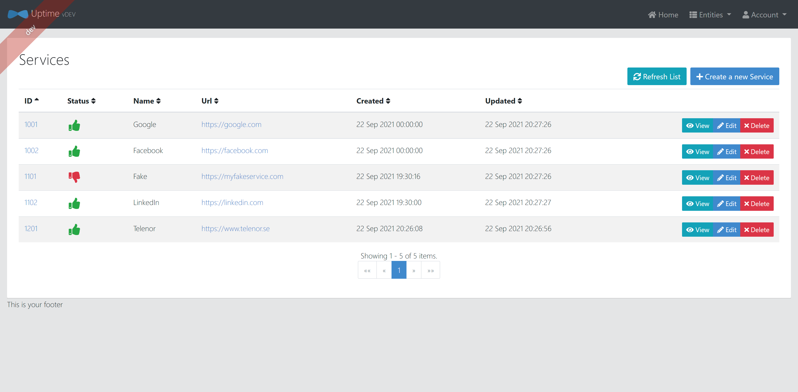

# uptime

This application was generated using JHipster 7.2.0, you can find documentation and help at [https://www.jhipster.tech/documentation-archive/v7.2.0](https://www.jhipster.tech/documentation-archive/v7.2.0).



## Testing

To run it:

```
./mvnw
```

Open any web browser and enter the below URL:

```
http://localhost:8080/
```

Default credentials:

```
Login: user
Password: user
```
